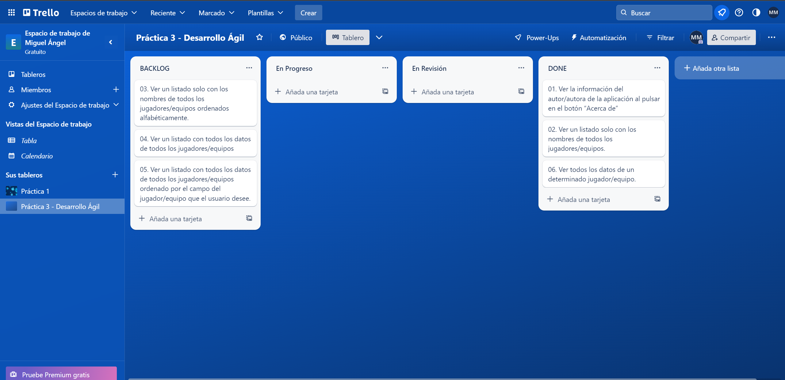
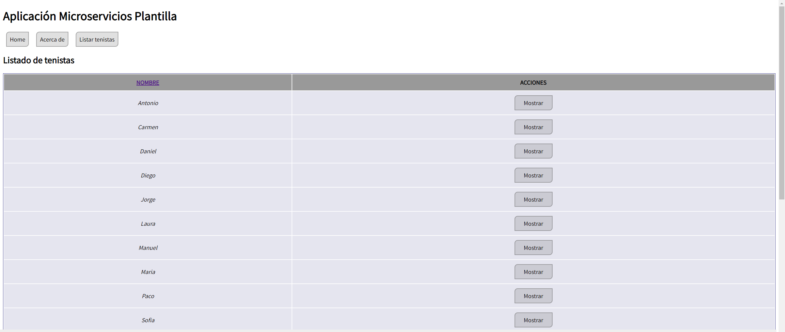
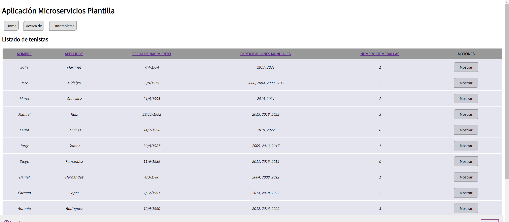
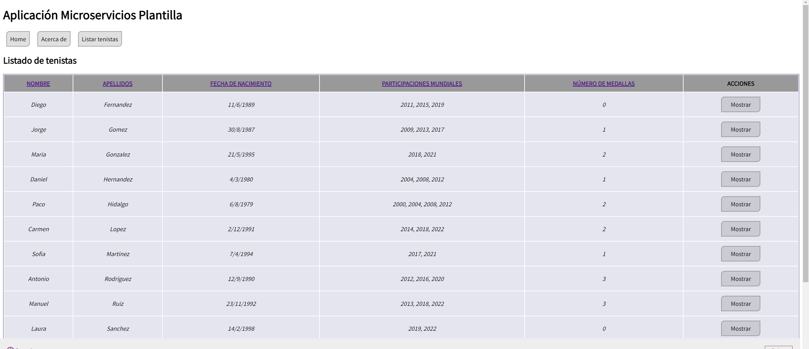
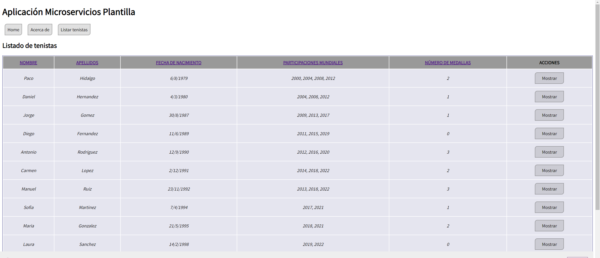
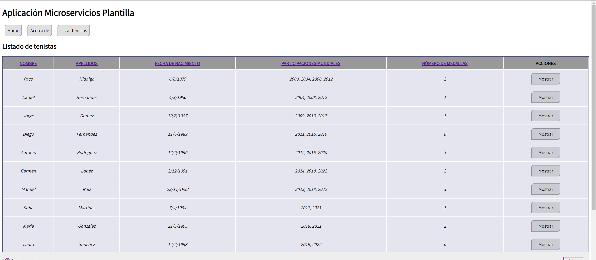
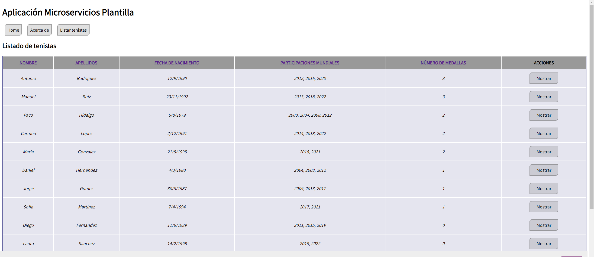
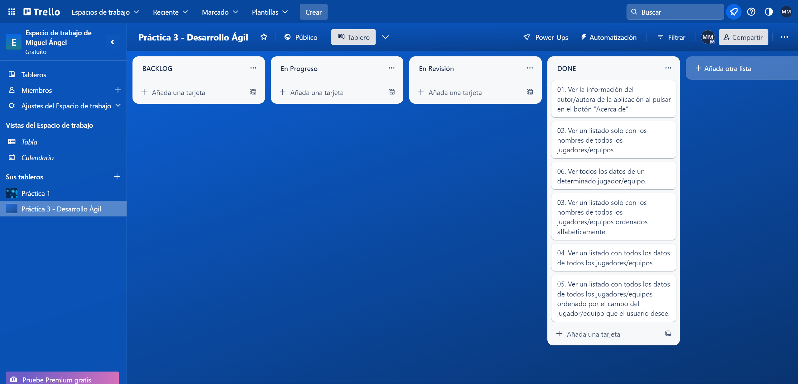

[](https://classroom.github.com/a/hneiFYl3)
[](https://classroom.github.com/online_ide?assignment_repo_id=10794664&assignment_repo_type=AssignmentRepo)
# *Práctica Microservicios*: documentación.
## Datos personales
### Miguel Ángel Hurtado Molina
* **Correo**: mahm0010@red.ujaen.es
* **Trello**: https://trello.com/b/OOEmBgrZ/pr%C3%A1ctica-3-desarrollo-%C3%A1gil

## Base de datos de Fauna
### Home
### Página en la que aparece la base de datos 
### Página en la que aparece la colección 

### Documentos creados en la colección
```js
{
  nombre: "Daniel",
  apellidos: "Hernandez",
  fechaNac: {
    dia: 4,
    mes: 3,
    ano: 1980
  },
  partMundial: [2004, 2008, 2012],
  numMedallas: 1
}

{
  nombre: "Paco",
  apellidos: "Hidalgo",
  fechaNac: {
    dia: 6,
    mes: 8,
    ano: 1979
  },
  partMundial: [2000, 2004, 2008, 2012],
  numMedallas: 2
}

{
  nombre: "Maria",
  apellidos: "Gonzalez",
  fechaNac: {
    dia: 21,
    mes: 5,
    ano: 1995
  },
  partMundial: [2018, 2021],
  numMedallas: 2
}

{
  nombre: "Antonio",
  apellidos: "Rodriguez",
  fechaNac: {
    dia: 12,
    mes: 9,
    ano: 1990
  },
  partMundial: [2012, 2016, 2020],
  numMedallas: 3
}

{
  nombre: "Laura",
  apellidos: "Sanchez",
  fechaNac: {
    dia: 14,
    mes: 2,
    ano: 1998
  },
  partMundial: [2019, 2022],
  numMedallas: 0
}

{
  nombre: "Jorge",
  apellidos: "Gomez",
  fechaNac: {
    dia: 30,
    mes: 8,
    ano: 1987
  },
  partMundial: [2009, 2013, 2017],
  numMedallas: 1
}

{
  nombre: "Carmen",
  apellidos: "Lopez",
  fechaNac: {
    dia: 2,
    mes: 12,
    ano: 1991
  },
  partMundial: [2014, 2018, 2022],
  numMedallas: 2
}

{
  nombre: "Diego",
  apellidos: "Fernandez",
  fechaNac: {
    dia: 11,
    mes: 6,
    ano: 1989
  },
  partMundial: [2011, 2015, 2019],
  numMedallas: 0
}

{
  nombre: "Sofia",
  apellidos: "Martinez",
  fechaNac: {
    dia: 7,
    mes: 4,
    ano: 1994
  },
  partMundial: [2017, 2021],
  numMedallas: 1
}

{
  nombre: "Manuel",
  apellidos: "Ruiz",
  fechaNac: {
    dia: 23,
    mes: 11,
    ano: 1992
  },
  partMundial: [2013, 2018, 2022],
  numMedallas: 3
}
```

## Incremento 1
Para el primer incremento he implementado las funcionalidades 1, 2 y 6.

Para ello empecé creando las correspondientes tarjetas en el tablero de Trello:

A continuación fui implementando las tres funcionalidades.

1:
2:
6:

Así, tras pasar todas las pruebas que había programado previamente y revisar el correcto funcionamiento de las funcionalidades, queda terminado mi primer incremento.

Así queda el tablero de Trello al final:


## Incremento 2
Para el segundo incremento decidí implementar las funcionalidades 3, 4 y 5:

Comencé con la número **3**, modificando la tabla con el listado de tenistas implementada anteriormente:

A continuación empecé a incluir el resto de datos de los tenistas en la tabla tal y como pide la funcionalidad número **4**:

Por último añadí la funcionalidad número **5** de forma que al pulsar con el ratón sobre el nombre de cualquiera de las columnas de la tabla con datos sobre el tenista, esta se ordenara de forma ascendente o descendente en función del dato que almacene dicha columna: Alfabéticamente en el caso del nombre o los apellidos, numéricamente en el caso de participaciones en mundiales o número de medallas y temporalmente en el caso de la fecha de nacimiento:

Una vez implementadas y comprobadas todas las funcionalidades, las marqué como completadas en el tablero de Trello finalizando así mi segundo incremento: